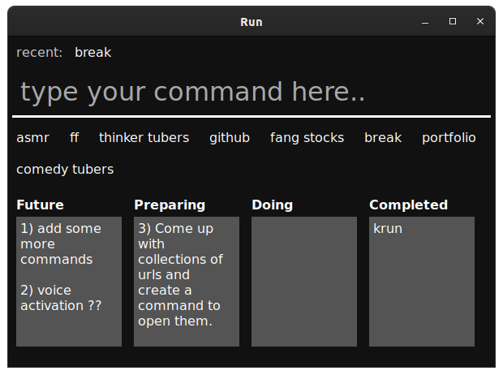

# About

A simple 'lightweight' interface for running common commands and automating workflow.

 - for example, opening informative websites related to a given stock ticker such as MSFT.
 - or opening a set of websites you enjoy viewing on breaks

Best to make it available to run on startup.

Added a basic kanban for easy 'todo' type recording.

Edit **config.go** to personalize.

# Why webview

I wanted to play around with golang webview at the time.

